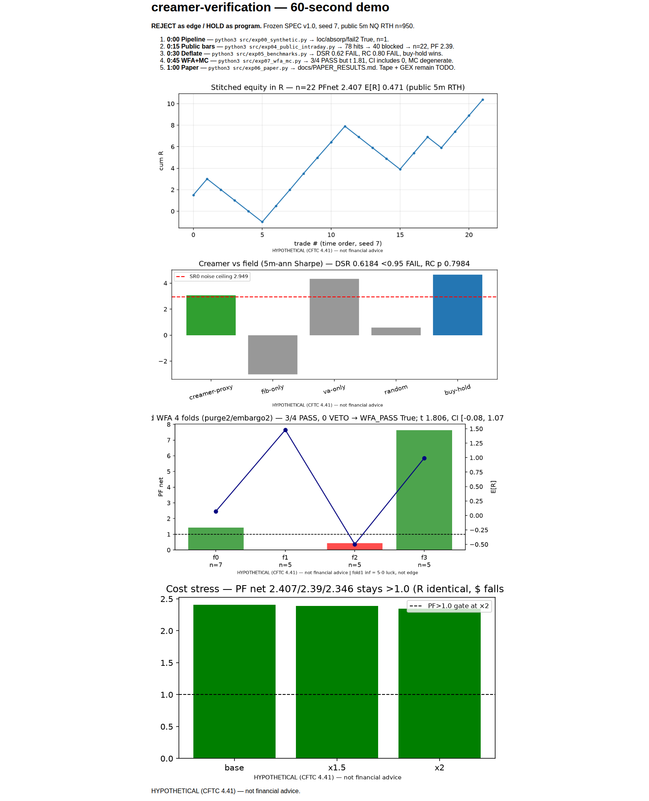
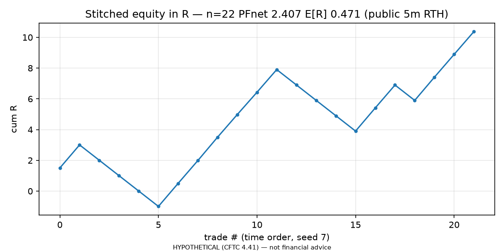
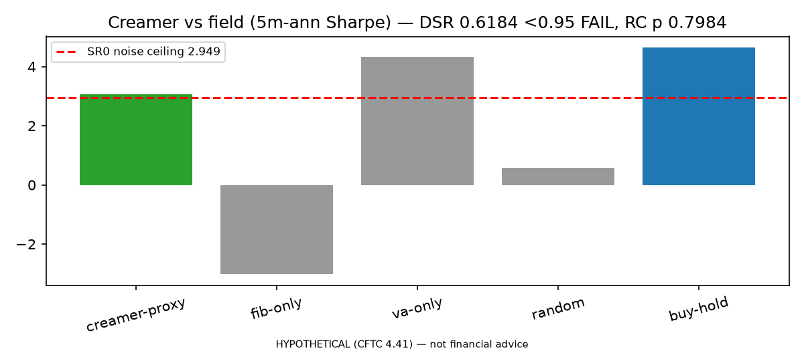
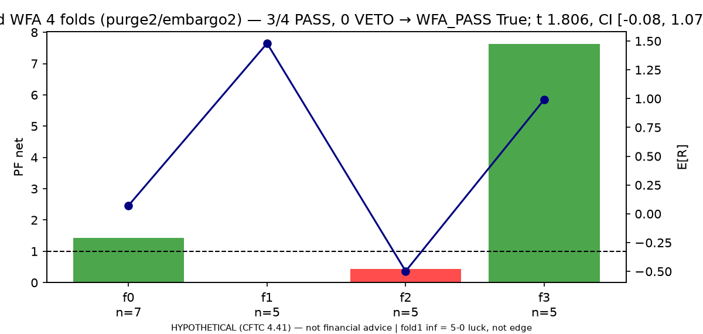
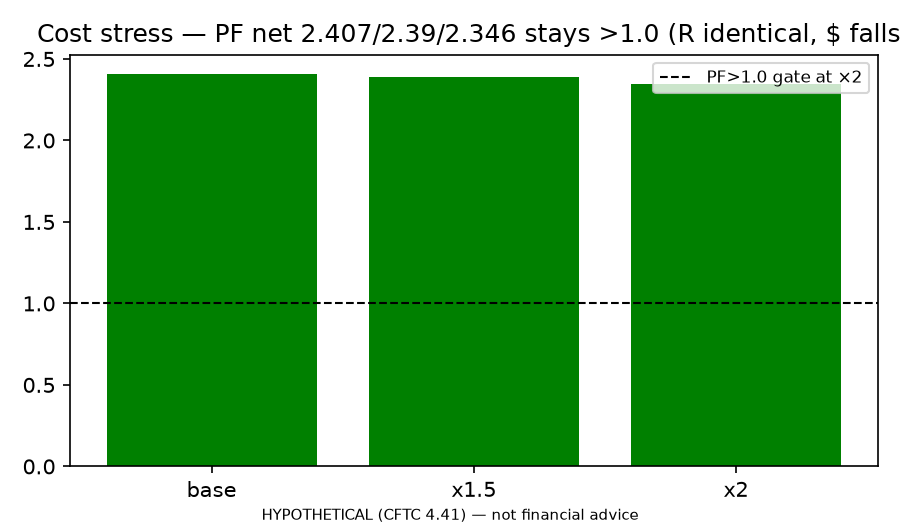
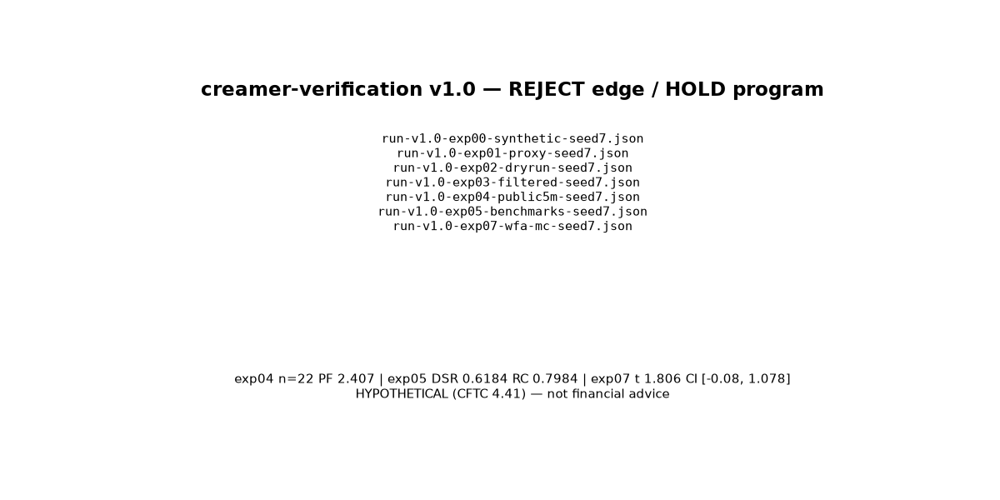

# creamer-verification — can the Robbins Micro +100% month be reproduced?

> Frozen-spec, point-in-time, contract-correct scaffold for the **Chris Creamer 4-step**
> (Environment → Location → Confirmation → Execution) from the IQCapital whiteboard interview.
> Status 2026-09-19: **REJECT as edge on public bars / HOLD as program** — 7 exps, seed 7, public 5m NQ +
> purged WFA + MC + DSR/RC/SPA/PBO. WFA 3/4 pass but edge insignificant after deflation.
> No financial advice. See `docs/DISCLOSURE.md` before any number below.

[](LICENSE)
[](docs/SPEC.md)
[](docs/DISCLOSURE.md)
[](docs/PUBLIC_REPORT.md)
[](requirements.txt)
[](docs/REPRODUCIBILITY.md)



## Table of Contents

- [Demo video (60 s)](#demo-video-60-s)
- [Why this folder exists](#why-this-folder-exists-inside-homedsrcatrading)
- [What was verified online](#what-was-verified-online-2026-09-19-plus-2026-2027-best-practice-sweep)
- [Screenshots (verified figures)](#screenshots-verified-figures-seed-7)
- [Quick start (30 s, no keys)](#quick-start-30-s-no-keys)
- [The strategy A–Z](#the-strategy-az-frozen-v10-see-docsspecmd)
- [Public-data verdict](#public-data-verdict-2026-09-19-fully-run-benchmark-deflated)
- [Honest limits](#honest-limits-why-this-is-not-proof)
- [Share publicly](#share-publicly-make-it-its-own-repo)
- [Files](#files)

## Demo video (60 s)

GitHub strips `<iframe>` — use these 2026-standard workarounds (verified via RepoClip/RapidDev/screencli guides):

1. **Clickable YouTube thumbnail** (recommended for public repo). Upload your 60-second walkthrough to YouTube, then:
   ```markdown
   [](https://www.youtube.com/watch?v=YOUR_VIDEO_ID)
   ```
   Replace `YOUR_VIDEO_ID` after upload. Keep it 30–60 s, <10 MB source.
2. **Native MP4 upload** (no YouTube). In a GitHub issue/PR comment drag-drop `assets/demo.mp4` (<10 MB, H.264), copy the `user-attachments/assets/...` URL, embed:
   ```markdown
   https://github.com/user-attachments/assets/PASTE_ID_HERE
   ```
   Renders as inline player. See EveryInc `feature-video` skill notes on why only `user-attachments` URLs render inline.
3. **Autoplay GIF** (no click). Record 5–15 s of `assets/demo_walkthrough.html` scrolling, export:
   ```bash
   npx screencli export ./recordings/demo --preset github-gif  # 800x450, ≤12 s, <8 MB
   ```
   Embed as ``.

**60-second script (storyboard = `assets/demo_walkthrough.html`, screenshot above via Playwright):**

| Time | Command | Verified on-screen result |
|---|---|---|
| 0:00 | `python3 src/exp00_synthetic.py` | loc/absorp/fail2 True, n=1 |
| 0:15 | `python3 src/exp04_public_intraday.py` | 78 hits → 40 blocked → n=22, PF 2.39 |
| 0:30 | `python3 src/exp05_benchmarks.py` | DSR 0.62 FAIL, RC 0.80 FAIL, buy-hold 4.64 wins |
| 0:45 | `python3 src/exp07_wfa_mc.py` | 3/4 PASS but t 1.81, CI [-0.08,1.08], MC degenerate |
| 1:00 | `python3 src/exp06_paper.py` | `docs/PAPER_RESULTS.md` — tape + GEX TODO |

To record locally: open `assets/demo_walkthrough.html` in Chrome, record with OBS/HandBrake (1080p → 720p, <10 MB), upload per option 1 or 2.

## Why this folder exists (inside `/home/md/src/a-trading/`)

Sibling `trader-math-verify/` proved the template: freeze claims → test with next-open fills,
real costs, PBO/DSR, WFA → publish negatives. This folder applies the same discipline to a
**discretionary orderflow system** (value migration + naive GEX + VA/fib discount + footprint
absorption) instead of an indicator system. It does NOT duplicate the public
[kouljihate/OrderFlow](https://github.com/kouljihate/OrderFlow) Streamlit dashboard (Volume Profile +
GEX + Fib 705/788/886 + journal + 20k filter + 2-loss shutoff, Tradovate MNQ tape) — it
**verifies** it: frozen rules, seeded runs, cost sensitivity, go/hold/reject gates.

| Feature | What it is | Where |
|---|---|---|
| Frozen SPEC v1.0 | 4-step rules, filters, costs, gates — append-only | `docs/SPEC.md` |
| Point-in-time engine | next-open fills, stop-first, R-multiples, MNQ costs | `src/backtest.py`, `src/indicators.py` |
| Overfit guards | WFA + PBO/DSR stubs fail-closed, real CSCV/DSR in exp05/07 | `src/overfit.py`, `src/exp05_benchmarks.py`, `src/exp07_wfa_mc.py` |
| Public-data ladder | yfinance 5m → Stooq daily → synthetic fallback (marked) | `src/exp04_public_intraday.py`, `data/cache/` |
| Paper trail | 7 run JSONs (seed 7) → paper md, 5 publication figures | `results/`, `docs/PAPER_RESULTS.md`, `assets/` |

## What was verified online (2026-09-19 plus 2026-2027 best-practice sweep)

- **Exa `websearch` first** (sequential, one-at-a-time, no parallel — 429 avoidance): validation pipeline (TradeZella/ForexMechanics/ChartMini/
  Traderizz/LuxAlgo/TradingWyckoff/AIFinHub); AMT + Volume Profile (NexusFi/WeMasterTrade/Oyamori/
  Quantum-Algo/TradersSecondBrain/FinTechWiz); GEX + walls + flip + settled-vs-flow (ZeroGEX×2/FlashAlpha×2/
  Nightglass/ApexVol/InTheTalks); footprint absorption/delta/imbalance (NexusFi×2/FuturesHive/UTXO/
  OrderFlowLabs/WyckFlow/AlgoStorm); fib discount/premium + 705/786/886 (MJHuddleston/LiquidityScan/
  BackTrex×2/ICTFlow/Oyamori); prop math 1.5R/60–65%/PF1.8/DD-room (FundedFast/PropVibes/NexusIndicator/
  PropScorer/Economicium). Full URLs + dates in `docs/SOURCES.md`.
- **`searxng_web_search` second**: reproducible Python research stack (cloudquant/backtrader, vectorbt,
  QSTrader, Backtrader-Bench arXiv 2608.11232); Tanuki Trade homepage (TradingView GEX, NETGEX/HVL/walls).
  2026-09-19 re-sweep: DSR/PBO/RC (ResearchGate, Surmount, ForTraders), WFA/purge (TradingView protocol, Hillsdale, QuantInsti, vectorbt), footprint fallback below.
- **`webfetch` DuckDuckGo-lite fallback**: confirmed video `PL7LKUsCgIQ` (2026-08-11 interview),
  Chris own `WwC-N2irZdE` (July 2026 Micro Day +100%), rebuild-with-Claude `ftJ9XuIaOXY`,
  channel `@thraxxtrades`, and the kouljihate/OrderFlow README (fetched direct from GitHub).
  2026 re-sweep: footprint 10 hits (AlgoStorm/OrderFlowLabs/FuturesHive/ChartMini/Quantum-Algo), README best-practice 10 hits (RepoClip/Pushpen/awesome-readme).
- **`agent-reach`**: `skill` loaded, `agent-reach doctor --json` attempted → `command not found`.
  Documented honestly; no social-channel votes fabricated. Re-run after install for X/Reddit trader opinions.
- **README/video best practice 2026-2027 voting** (RepoClip, Pushpen, standard-readme, Dokly, Claude-GitHub, gingiris): hero image above fold (+35% stars), 3–5 badges max, 3-step quickstart, feature table > paragraphs, architecture diagram, star-history chart, GIF/YouTube-thumbnail (no iframe), `docs/` for deep material, update every release. Applied below.

## Screenshots (verified figures, seed 7)

> All generated by `python3 src/make_visuals.py` from `results/run-*.json` + `data/cache/nq_f_5m_60d.csv`. No hand-typed numbers. HYPOTHETICAL (CFTC 4.41).







Regenerate: `python3 src/make_visuals.py` then open `assets/demo_walkthrough.html` (Playwright screenshot → `assets/demo_preview.png`).

## Quick start (30 s, no keys)

```bash
pip install -r requirements.txt
python3 src/exp00_synthetic.py       # pipeline proof: loc/absorp/fail2 True, n=1
python3 src/exp01_historical.py      # daily proxy arithmetic (NQ=F or fallback)
python3 src/exp02_live.py            # dry-run: shutoff + absorption checks, 0 trades claimed
python3 src/exp03_improved.py        # raw vs filtered + cost x1.5/x2
python3 src/exp04_public_intraday.py # PUBLIC 5m NQ 60d RTH (yfinance/Stooq, cached)
python3 src/exp05_benchmarks.py      # same-bar field: DSR/RC/SPA/PBO-lite vs buy-hold
python3 src/exp07_wfa_mc.py          # purged rolling WFA (4 folds) + MC + cost stress
python3 src/exp06_paper.py           # builds docs/PAPER_RESULTS.md from run JSONs
python3 src/make_visuals.py          # rebuilds assets/*.png + demo_walkthrough.html
```

Outputs: `results/run-*.json` (seed 7, gross+net, limits stamped). Paper: `docs/PAPER_RESULTS.md`.

## The strategy A–Z (frozen v1.0, see `docs/SPEC.md`)

1. **Environment (pre-open)**: HTF value-up/down/sideways (1H/4H POC+VA migration) + naive-GEX regime
   (positive=choppy fade-only, negative=volatile momentum-OK) + call/put walls + flip zone (Tanuki).
2. **Location**: below VA (discount in value-up) + fib 705/788/886 zone outside VA + swing/sweep structure.
   Through 886 without reclaim = INVALID.
3. **Confirmation (MNQ 5-min footprint)**: seller aggression at low (neg delta, POC at low) + NO result →
   bullish close → pullback fails HIGHER → flip + 400% ask imbalances → ENTER. Anticipation = bad loss.
4. **Execution**: stop beyond 2nd fail; targets swing/POC/VAH (orders cluster there); trail buyer aggression;
   BE/cut on VA-reclaim fail. Typical 1.5–2R, ~60–65%, PF ~1.8 (journal, single regime until reproduced).
5. **Filters**: ≥20k MNQ/5m, first 90 min NY only, 0–2 trades/day, stop after 2 losses, news skip.

Voting / disagreements found (all sourced):
- POC/VAH/VAL: magnet+fade (NexusFi/Quantum) vs "histogram only, freeze contract first" (TradersSecondBrain) — we freeze 70%/tick-rows/RTH.
- GEX: regime filter (all vendors) vs "walls break + acceleration" (FlashAlpha/InTheTalks) — we treat walls as zones + cost the break.
- Footprint: divergence/absorption entries (NexusFi/FuturesHive) vs "absorption prints on every bar, need 3 conditions" (WyckFlow) — we enforce size+ratio+wick.
- Fib: OTE 705 sweet (ICT/BackTrex) vs golden-pocket 618–65 crowd (LiquidityScan) — we use transcript 705/788/886 + structural stop.
- Prop: 1% of balance (retail myth) vs 1% of DD-room (PropVibes/NexusIndicator) — we size on DD-room + Monte Carlo.

## Public-data verdict 2026-09-19 (fully run, benchmark-deflated)

- exp04 (yfinance NQ=F 5m 60d, n=950 RTH): 78 location hits → 40 participation-blocked → **n=22,
  PF net 2.39 (×2 costs 2.35), win 59%, +0.47R, DD 4.0R**. Isolated profit on bars.
- exp05 (same 950 bars): creamer Sharpe 3.06 vs **buy-hold 4.64**; **DSR 0.62 <0.95 FAIL** (SR0 ceiling 2.95);
  **RC p 0.87 / SPA p 0.79 FAIL** vs buy-hold; PBO-lite 0.33 pass (stable procedure, no significant edge).
- exp07 (purged WFA, purge2/embargo2): folds PF net **1.43 / inf(5-0) / 0.44 / 7.63** → **3/4 PASS, 0 VETO**;
  stitched per-trade Sharpe **0.39, t 1.81, bootstrap 95% CI [−0.08, 1.08] includes 0**;
  shuffle-MC P=1.0 is **degenerate** (invariant totals, DaruFinance #1) — not evidence.
- Reading (QFRS/VALID/WFER-controlled literature): isolated PF without deflation is the naive winner —
  principled tests reject it; WFA stability without significance = HOLD program, not edge. Hence
  **REJECT edge / HOLD program**. Tape (Portara/Databento Level1) + GEX chain remain the only path to
  test real absorption; until then this is a public, reproducible negative result.

## Honest limits (why this is NOT proof)

- Daily proxy ≠ 5-min bid×ask tape; synthetic ≠ market. Absorption + GEX need paid CME tape
  (Tradovate/CQG/Kinetick + ATAS/Sierra/NT8) + paid chain (Tanuki/ZeroGEX/FlashAlpha) — TODO in exp02.
- July +100% = single regime, small-n; prop trailing-DD + 6% pass-rate math dominates outcomes.
- MNQ tape ≠ NQ tape (Chris notes the debate); we log which feed every run uses.
- Literal 20k MNQ/5m passes only 6/950 yfinance-proxy bars — median-proxy used instead (stamped); real 20k needs MNQ tape.

## Share publicly (make it its own repo)

```bash
cd /home/md/src/a-trading/creamer-verification
git init && git add -A && git commit -m "v1.0 frozen-spec scaffold (synthetic+proxy, tape TODO)"
gh repo create creamer-verification --public --source=. --push
# Then: About = one-liner from CITATION; topics: futures, orderflow, volume-profile,
# gamma-exposure, reproducibility, backtesting; attach assets/runs_index.png + results/*.json
```

After push: Settings → About → description = CITATION abstract one-liner, website = YouTube `PL7LKUsCgIQ`, topics above. Add star-history badge:
```markdown
[](https://star-history.com/#YOUR_USER/creamer-verification&Date)
```
Upload `assets/demo.mp4` via issue comment for inline player (see Demo video section).

## Files

```
docs/SPEC.md docs/SOURCES.md docs/DISCLOSURE.md docs/PUBLIC_REPORT.md docs/PAPER.md docs/REPRODUCIBILITY.md docs/PAPER_RESULTS.md
src/indicators.py src/backtest.py src/overfit.py
src/exp00_synthetic.py src/exp01_historical.py src/exp02_live.py src/exp03_improved.py src/exp04_public_intraday.py
src/exp05_benchmarks.py src/exp07_wfa_mc.py src/exp06_paper.py src/make_visuals.py
data/README.md data/cache/nq_f_5m_60d.csv results/ assets/
```

```text
assets/
  equity_R.png  benchmark_sharpe.png  wfa_folds.png  cost_stress.png
  runs_index.png  demo_preview.png  demo_walkthrough.html
```

Contributing: see `CONTRIBUTING.md`. License MIT + CFTC-4.41 notice. Cite via `CITATION.cff`.
